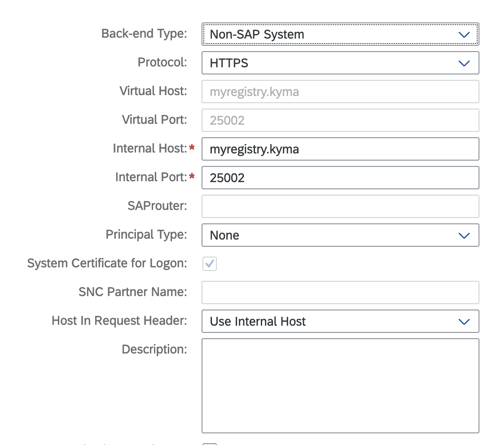
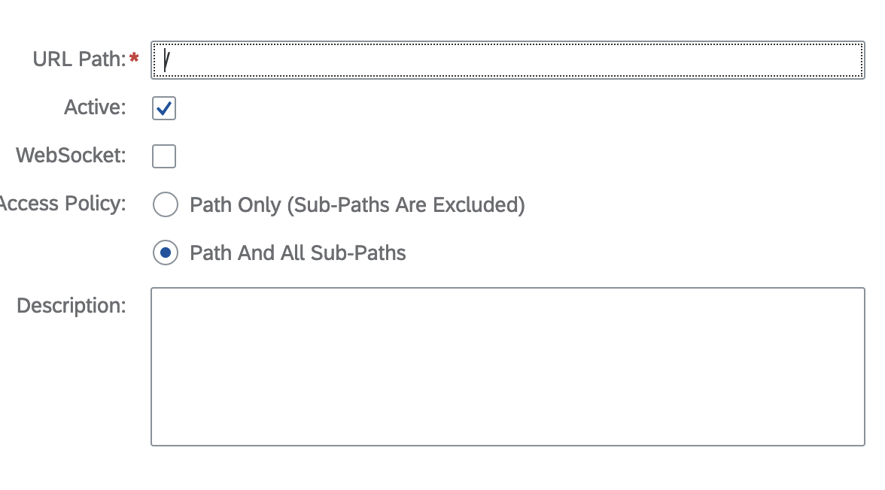
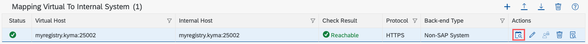

# Manual test for Registry Proxy

## Prerequisites

- BTP Kyma Cluster with connectivity-proxy module enabled
- Docker installed & running
- Kubectl
- [Registry Proxy repository](https://github.tools.sap/kyma/registry-proxy)
- [Sample on-premise Docker Registry from Kyma runtime extension samples repository](https://github.com/SAP-samples/kyma-runtime-extension-samples/tree/main/on-premise-docker-registry)
- [Unpacked Cloud Connector Download](https://tools.hana.ondemand.com/#cloud)
- Export variables listed below

```bash
export KUBECONFIG=<btp-kyma-cluster-kubeconfig>
export EMAIL=<your-email>
export NAMESPACE=<namespace where the workload will be deployed>
export CLUSTER_DOMAIN=$(kubectl get cm -n kube-system shoot-info -ojsonpath='{.data.domain}')
export REG_USER_NAME=<registry username>
export REG_USER_PASSWD=<registry password>
```

## Steps

### Cloud Connector

1. Run the go.sh script from the Cloud Connector download.

```bash
NO_CHECK=1 ./go.sh
```

You may need to add an exception in your system settings under "Privacy & Security" on your first try.

2. Go to the link specified in the output.

```bash
Cloud Connector <version> started on <link you need to follow>
```

3. Log in with the default credentials.
   - Username: `Administrator`
   - Password: `manage`
     You will be prompted to change the password make note of it.
4. Download authentication data from your BTP subaccount.
   - Go to Connectivity -> Cloud Connectors.
   - Download the file.
5. Back in Cloud Connector create a BTP Subaccount. HTTPS Proxy isn't needed.
   Use the authentication data from previous step to configure the account.

### On-Premise Docker Registry

Inside the `kyma-runtime-extension-samples` repository, open a terminal in the `on-premise-docker-registry` subfolder:

1. `make generate-self-signed-cert` You will be prompted to enter details during this step.
2. `make trust-self-signed-cert`
3. `make generate-htpasswd`
4. `make start-docker-registry`
5. Edit the `/etc/hosts` file on your PC and add the following line: `127.0.0.1 myregistry.kyma`

### Cloud Connector #2

Back inside the Cloud Connector UI:

1. Go to the "Cloud to On-Premise" section and under the "Mapping Virtual to Internal System" click the "+" button.
   Fill it as shown below and save. Uncheck the "Allow Principal Propagation" option:
   
2. A new category will appear below "Resources of <your registry name> once again click the "+" button.
   Fill it as shown below and save:
   
3. Click "check availability of onternal host" button to make sure the Cloud Connector was configured properly, and the cluster can access on-prem Docker registry:
   

### Registry Proxy

Inside the `registry-proxy` repository:

1. Create a namespace for the Registry Proxy.

```bash
kubectl create namespace ${NAMESPACE}
```

<!-- TODO: broken RN -->

2. You can get images for your changes by pushing them and grabbing them from the build job or build the Docker images yourself for Controller and Registry Proxy and push them.

```bash
	make -C components/registry-proxy docker-build CTRL_IMG="registry-proxy-controller:main"
	make -C components/connection docker-build IMG="registry-proxy-connection:main"
```

3. Install the Helm chart.

```bash
helm install registry-proxy config/registry-proxy -n ${NAMESPACE} \
  --set controllerManager.container.image.repository="<registry-proxy-controller>" \
  --set controllerManager.container.image.tag="<latest>" \
  --set controllerManager.container.env.PROXY_IMAGE=<registry-proxy:latest>
```

4. Apply a minimalistic RegistryProxy CR.

```yaml
apiVersion: operator.kyma-project.io/v1alpha1
kind: RegistryProxy
metadata:
  name: registry-proxy-myregistry
  namespace: <NAMESPACE>
spec:
  targetHost: "myregistry.kyma:25002"
```

### On-Premise Docker Registry #2

Back inside the `on-premise-docker-registry` subfolder inside the `kyma-runtime-extension-samples` repository:

1. `export NODE_PORT=$(kubectl get registryproxies.operator.kyma-project.io -n ${NAMESPACE} registry-proxy-myregistry -o jsonpath={.status.nodePort})`
2. `make docker-login`
3. `make create-test-image` note the image tag. For example `on-prem-nginx:<current date and time>`
4.

```bash
kubectl -n ${NAMESPACE} create secret docker-registry on-premise-reg \
    --docker-username=${REG_USER_NAME} \
    --docker-password=${REG_USER_PASSWD} \
    --docker-email=${EMAIL} \
    --docker-server=localhost:${NODE_PORT}
```

5. Edit the line #23 in `test-image-deployment/deployment.yaml` to use the image tag from the third step and the node port from the first step.

```yaml
- image: localhost:<node-port>/<your-image-tag>
```

for example:

```yaml
- image: localhost:30648/on-prem-nginx:2025-04-14-15-36
```

6. `make deploy-test-workload`
7. `make check-test-workload` Should check if the pod is running.
8. `make access-test-workload` Should connect you to the test workload.
